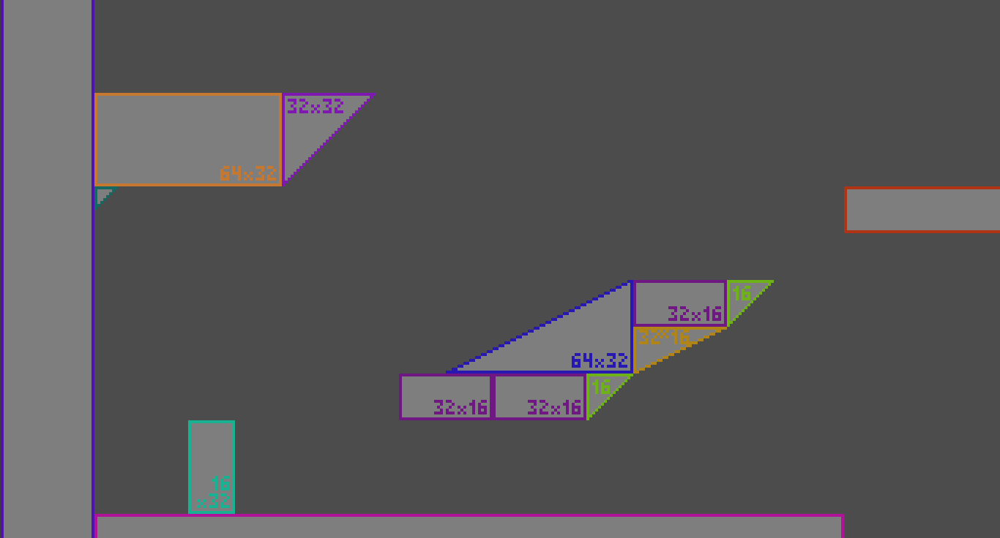
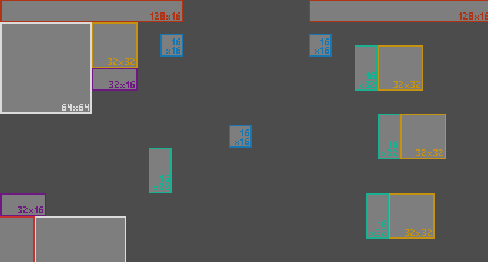
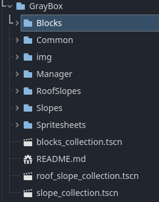
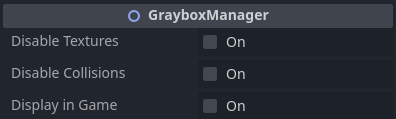
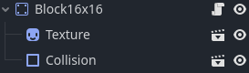
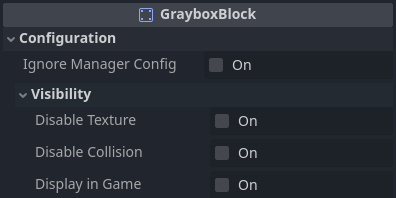
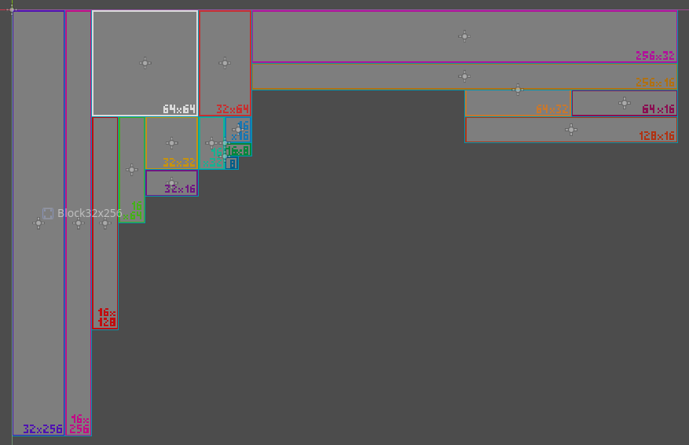
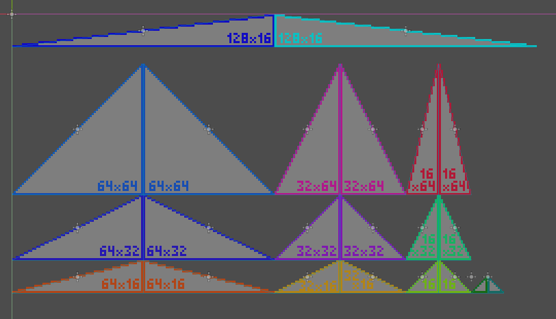
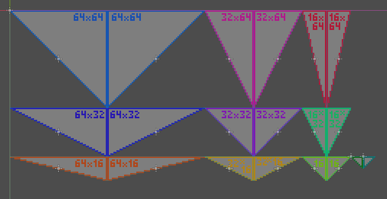

# Godot 2D Pixelart Grayboxing
A set of simple pixelart assets for grayboxing in 2D Godot projects.

The blocks all have their own sprite and collision so you can work on your level's geometry and decoration separately and still have a consistent collision geometry.

## Examples
These are a few examples of ways of using this assets.
### 2D Side View

> Use cases: Platformers, Metroidvanias, Runners, Run and Gun.

### Top Down View

> Use cases: Classic RPG, Survivors, Top Down Shooters, Twin Stick Shooters.
## Setup
To add this to your Godot project, open a terminal in the directory
where you want the assets to be located on and run this command:

```sh
git clone https://github.com/Sir-Floppa/Godot-2D-Pixelart-Grayboxing
```
> Recommendation: Remove the .git folder on the resulting folder so you don't have trouble with your git repo tracking it.

or this, if you want your repo to keep track of changes on your project independently of the Grayboxing assets.

```sh
git submodule add https://github.com/Sir-Floppa/Godot-2D-Pixelart-Grayboxing
```
> In this case you should run the command any time you need to set up your project again. It would be a nice idea to place it in a shell script to handle it for you.

## Usage
Once you have added the assets to your project, you will have a few new things:


- **Blocks:** Here you will find the scenes for square-like graybox scenes.
- **Common:** There are stored the script for all tiles and the two base collision and texture components.
- **Manager:** The GrayboxManager scene is stored here, it is the node used as container for GrayboxBlocks.
- **Slopes and RoofSlopes:** This one contains the triangular blocks.
- **Spritesheets:** Here is the texture png and pxo for the blocks art.

### The GrayboxManager
This node (or script for a Node2D) is made to contain GrayboxBlocks, and manage a few settings for them.



- **Disable Textures:** Defines if the blocks within the manager are visible.
- **Disable Collisions:** Defines if the blocks within the manager are collisionable.
- **Display in Game:** Defines if the blocks within the manager are visible inside the game. (you can have your blocks visible on the editor and invisible on the game).

### The Blocks
Blocks have two child nodes, a Texture component and a Collision component.



On the Inspector you will see the block's configuration. The visibility section are the same options and functionality are the same as [the GrayboxManager](#the-grayboxmanager)'s.



The **Ignore Manager Config** defines if the block you selected ignores the configuration you stablished on the manager, and should be enabled if you will use another settings on this block. This is the case if you are using a block in a standalone manner too.

### Naming
Blocks are named following this format:
> type_width_x_height

E.g. block_16x32

Slopes have an aditional part on their name:
> type_asc/desc_width_x_height

They will have _asc_ if the slope they have is positive and _desc_ if it is negative.

### Collections
The Collections Scenes located on the Graybox folder are nodes that contain all the blocks of a certain category, so you can spawn them on your level's scene and Ctlr+D your way through the level your designing.
They are separated by categories because I can certainly think of games that won't use the slopes at all, so you don't need to bloat your worspace to use the default collections.



